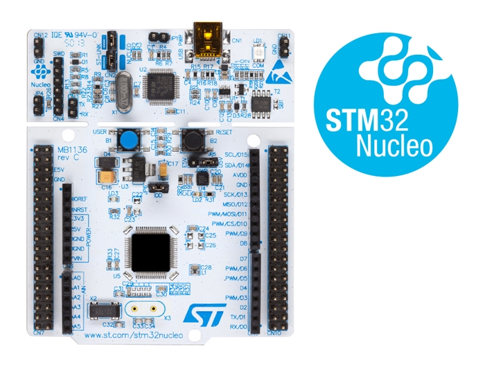
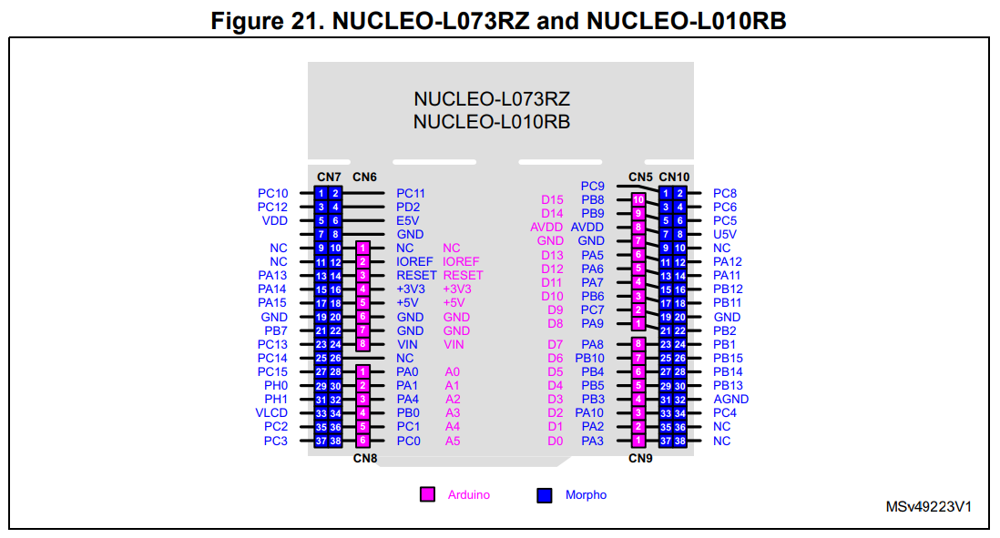
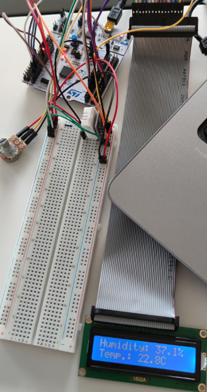
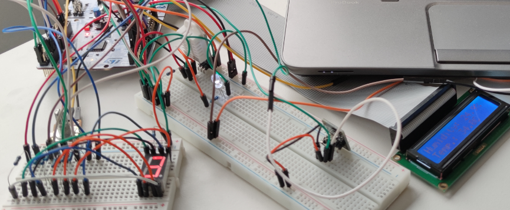
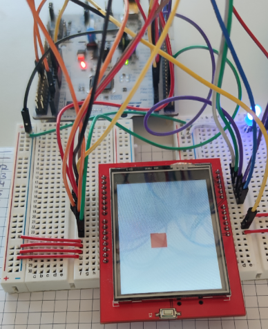

# STM32L010RB on a Nucleo-64 development board

### Layout
   
   

### Documentation
   - [Nucleo-64 Data brief](https://www.st.com/resource/en/data_brief/DM00105918.pdf)
   - [Nucleo-64 User manual](https://www.st.com/resource/en/user_manual/dm00105823-stm32-nucleo-64-boards-mb1136-stmicroelectronics.pdf)
   - [STM32 Programming manual](https://www.st.com/resource/en/programming_manual/dm00104451-cortexm0-programming-manual-for-stm32l0-stm32g0-stm32wl-and-stm32wb-series-stmicroelectronics.pdf)
   - [STM32 Reference manual](https://www.st.com/resource/en/reference_manual/dm00443854-ultra-low-power-stm32l0x0-advanced-arm-based-32-bit-mcus-stmicroelectronics.pdfm)
   - [HAL User manual](https://www.st.com/resource/en/user_manual/dm00113898-description-of-stm32l0-hal-and-low-layer-drivers-stmicroelectronics.pdf)

### Projects / Drivers
   #### Digital humidity & temperature sensor (DHT22)  
   
   #### Multiple DHT22's remote controlled via IR
   
   #### 8-Bit parallel TFT-Driver (ILI9341)
   